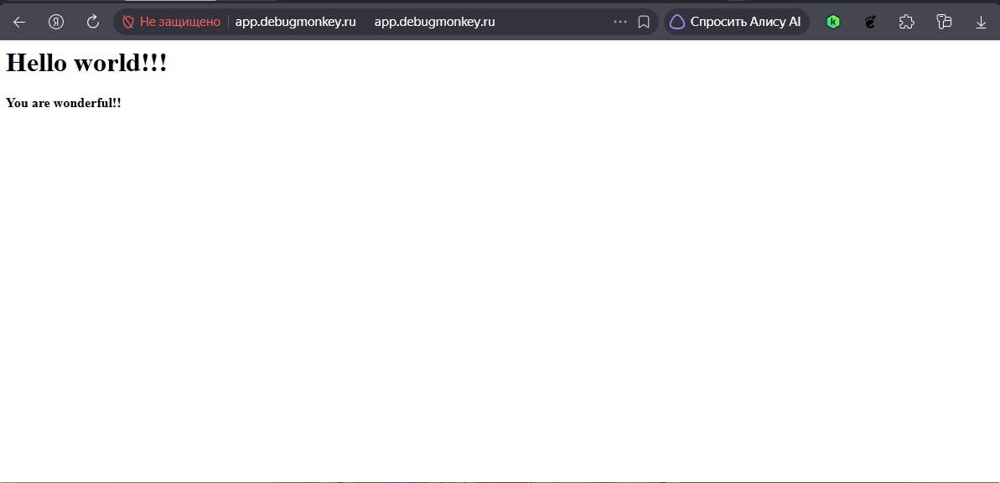
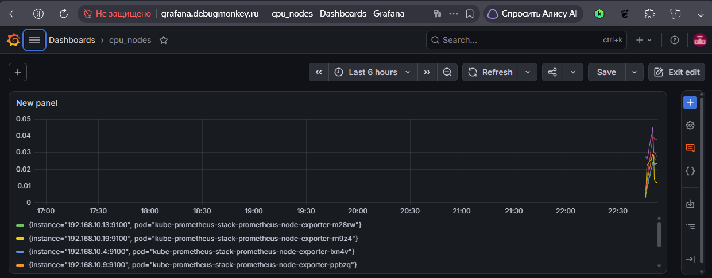
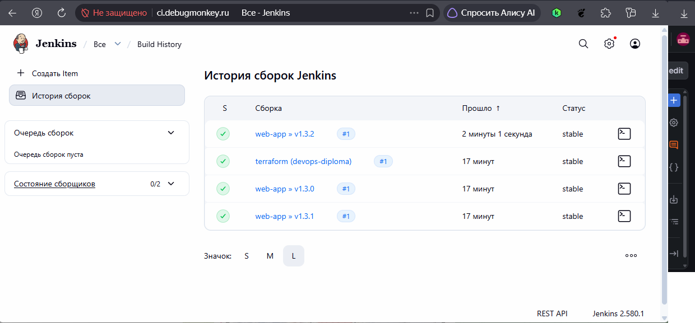
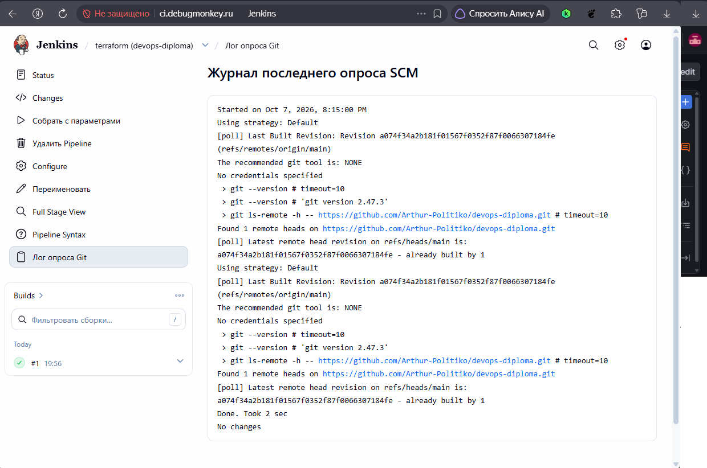

# Дипломный практикум: что и как сделано

Кратко о решениях по каждому этапу задания. 

## Стенд в двух словах

Yandex Cloud, зоны `ru-central1-a` и `ru-central1-b`. Self-hosted Kubernetes
на девяти прерываемых машинах, собранный `kubeadm` через Ansible.

| Роль | Машин | Зачем |
|---|---|---|
| `nat` | 1 | выход приватных нод в интернет, публикация ingress |
| `bastion` | 1 | точка входа для SSH |
| `admin` | 1 | управление кластером, CI |
| control-plane | 3 | мастера |
| worker | 3 | нагрузка |

Публичный адрес один — зарезервированный у NAT-ноды (`51.250.1.30`). На него
wildcard-записью смотрит домен `debugmonkey.ru`, поэтому ссылки не меняются
при пересборке стенда.

## Этап 1. Облачная инфраструктура

**Требовалось:** сервисный аккаунт, S3-бэкенд для состояния, VPC с подсетями
в разных зонах доступности, воспроизводимые `apply` и `destroy`.

**Сделано:**

- `bootstrap/` — каталог, сервисный аккаунт, его ключ и бакет для состояния.
  Отдельный root с отдельным состоянием: он создаёт предпосылку для остального.
- `tf/` — сеть (две публичные и две приватные подсети в двух зонах), NAT-нода
  с маршрутом по умолчанию для приватных подсетей, девять машин, Container
  Registry, зарезервированный статический адрес.
- Состояние хранится в Object Storage, бакет `tfstate-devops-diploma`.
- Terraform генерирует `ansible.cfg` и inventory из своего состояния, поэтому
  после `apply` руками править ничего не нужно.

**Проверка:** `cd tf && terraform plan` → `No changes`.

## Этап 2. Kubernetes кластер

**Требовалось:** не меньше трёх машин, Ansible для установки, рабочий кластер
и доступ `kubectl`.

**Сделано:** 16 плейбуков в `ansible/`, головной — `90-install-k8s.yaml`,
порядок совпадает с нумерацией файлов. Что делают: Python на нодах, containerd,
kubeadm 1.35, инициализация первого мастера, присоединение воркеров и двух
оставшихся мастеров, kubeconfig на admin-ноде, Flannel. Все машины прерываемые:
кластер переживает остановку и поднимается сам.

**Проверка:** `kubectl get nodes` → шесть нод `Ready`.

## Этап 3. Тестовое приложение

**Требовалось:** отдельный репозиторий с nginx-конфигом, Dockerfile и образ
в реестре.

**Сделано:** репозиторий [web-app](https://github.com/Arthur-Politiko/web-app) —
nginx со статической страницей и Dockerfile в `server/`. Образы собирает
пайплайн и кладёт в Yandex Container Registry `crpj27virc0v36d3u7rq/hub`
с меткой версии, номера сборки и `latest`.

В репозитории приложения остались только код и `Jenkinsfile`. Манифесты
Kubernetes переехали в инфраструктурный репозиторий: они описывают не
приложение, а то, как оно живёт в этом кластере, и для другого приложения
отличались бы парой значений.

## Этап 4. Мониторинг и деплой приложения

**Требовалось:** Prometheus, Grafana, Alertmanager и экспортер метрик,
деплой приложения, доступ на 80 порт, terraform-пайплайн.

**Сделано:**

- Стек `kube-prometheus-stack` ставится плейбуком `30-monitoring.yaml`:
  Prometheus, Grafana, Alertmanager, `node_exporter` демонсетом на все ноды,
  `kube-state-metrics` и 25 дашбордов из чарта.
- Приложение и Grafana опубликованы на 80 порту через `ingress-nginx`.
  Публичного адреса у нод нет, поэтому вход сделан пробросом порта на
  NAT-ноде, а сервисы разводятся по именам хостов.
- Terraform-пайплайн — сборка `terraform` в Jenkins: на коммит в `main`
  считает план, применение запускается параметром сборки. Это вариант
  «пайплайн в своей CI-системе», который задание допускает наравне
  с Atlantis и Terraform Cloud.
- Приложение задеплоено в namespace `web-app`.

**Проверка:** <http://grafana.debugmonkey.ru/> (дашборды кластера),
<http://app.debugmonkey.ru/> (страница приложения).

**Тестовое приложение** — опубликовано на 80 порту, отвечает снаружи:



**Grafana** — дашборд `cpu_nodes` с метриками `node_exporter` со всех нод кластера:



## Этап 5. CI/CD

**Требовалось:** автоматическая сборка образа на коммит, автоматический
деплой, интерфейс CI по http, релиз по тегу.

**Сделано:** Jenkins на admin-ноде, конфигурация описана кодом: установка —
`ansible/34-jenkins.yaml`, пользователь, права и job'ы —
`ci/jenkins/jenkins-casc.yaml.j2`, логика сборок — `Jenkinsfile` в репозиториях.
В интерфейсе руками не настраивается ничего.

- **Коммит в `main`** — multibranch-джоба собирает образ и пушит его с меткой
  номера сборки и `latest`.
- **Тег `v*`** — сборка с меткой версии, `kubectl set image` и ожидание прокатки.
- Права пайплайна ограничены: ServiceAccount в одном namespace, только `patch`
  на deployments и чтение pods и replicasets.

**Проверка:** интерфейс <http://ci.debugmonkey.ru/>.

История сборок Jenkins. Видны обе job'ы: `terraform (devops-diploma)` — тот самый
terraform-пайплайн, и `web-app` с релизными сборками по тегам `v1.3.0`, `v1.3.1`,
`v1.3.2`. Скриншот снят после пересборки стенда с нуля: теги нашёл сканер
multibranch-джобы, сборки прошли без ручного запуска.



Опрос репозитория инфраструктурной job'ой — terraform-пайплайн запускается
на коммит в `main` сам, без ручного нажатия:



Полные логи сборок:

- [terraform](data/diplom-data-full-tera-log.txt) — `fmt`, `init`, `validate`,
  `plan`; стадия применения пропущена, потому что параметр `APPLY` не выставлен.
- [web-app v1.3.2](data/diplom-data-full-web-app-log.txt) — проверка окружения,
  сборка и пуш образа, затем `kubectl set image` и ожидание прокатки
  до `successfully rolled out`.

## Что нужно для сдачи

| Пункт задания | Где лежит | Скриншот |
|---|---|---|
| Репозиторий с Terraform | этот репозиторий, `bootstrap/` и `tf/` | |
| Пайплайн terraform | Jenkins, сборка `terraform` | [diplom-ci.png](img/diplom-ci.png) |
| Репозиторий с Ansible | этот репозиторий, `ansible/` | |
| Dockerfile приложения и образ | `web-app`, образ в `cr.yandex/crpj27virc0v36d3u7rq/hub` | |
| Репозиторий с конфигурацией Kubernetes | этот репозиторий, `k8s/` | |
| Ссылки на приложение и Grafana | <http://app.debugmonkey.ru/>, <http://grafana.debugmonkey.ru/> | [diplom-app.png](img/diplom-app.png), [diplom-observing.png](img/diplom-observing.png) |

## Доступы

Пароли лежат в каталоге `vault/`, который исключён из git:

| Что | Файл |
|---|---|
| Grafana, пользователь `admin` | `vault/grafana_admin_password` |
| Jenkins, пользователь `admin` | `vault/jenkins_admin_password` |
| SSH-ключ к нодам | `vault/id_ed25519` |

## Как поднять с нуля

```bash
# 1. Инфраструктура
cd bootstrap && ./00-bootstrap.sh        # сервисный аккаунт, ключ, бакет
cd ../tf && terraform init -backend-config=... && terraform apply

# 2. Кластер и всё остальное
cd ../ansible && ansible-playbook -i inventory.ini 90-install-k8s.yaml
```

Стенд проверен прогоном с нуля: восемь машин пересозданы, конвейер Ansible
прошёл целиком, кластер, мониторинг, ingress и CI поднялись с пустых дисков.

## Что осознанно отложено

Коротко: роль `admin`
у сервисного аккаунта terraform, открытые security groups, единственный мастер
в endpoint кластера.
